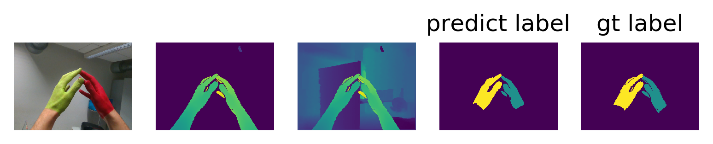

### 1. requirements

- numpy
- pytorch >=1.1.0
- tensorboard
- matplotlib
- Pillow  
 
If any other package is missed, just run "pip install xxx" to get it.  
I build the project under ubuntu16.04, cuda 8.0

### 2. Prepare code

clone this repo 

```bash
git clone https://github.com/liwenssss/HandSeg.git
cd HandSeg
```

### 3. Prepare data

download the data from : https://pan.baidu.com/s/1BSQvR_dZpz7-EY_fI-uvvg ,extract code:or0i

If the link is missed, please contact me via email.  

I strongly suggest you open a vip service when you download the data if you find the download speed is slow which will save you time.  

After you finished the download step, modify the config.py:

```python
HAND_SEG_EGO_DATA_PATH = '/path/to/the/dataset/paintedHands/ego'
```

Then, run:

```bash
cd dataset
python generate_data.py 
cd ..
```

It will generate two npz file under ./dataset  

Modify the config.py again:  

```python
TMP_HAND_SEG_EGO_DATA = '/path/to/the/code/HandsSeg/dataset/ego_train.npz'
TMP_HAND_SEG_EGO_TEST_DATA = '/path/to/the/code/HandsSeg/dataset/ego_test.npz'
```

### 4. Test example

You can use the terminal satisfied the requirements to run the following test demo, but I still suggest you using an IDE such as pycharm. All the following test is ok under pycharm.

#### 4.1 predict the labels of depth images  under example/,  run:

```bash
python test_example.py
```

it will show the input depth image as well as the predict label.

#### 4.2 test on the test dataset:

- if you want to see the visual results , run:

```bash
python test_dataset.py --mode "show"
```

- if you want to save the predicted label, run:

```bash
python test_dataset.py --mode "save"
```  
it will take about 1 hour, the saved images are like this:  
</br></br>
<p align="center">
    
</p>  
from left to right: rgb image, depth image, my synthesis with environmental information, predict label and ground truth label.  

- if you want to get the mIou score, run:

```bash
python test_dataset.py --mode "miou"
```  
it will take about 1 hour. In my experiment, the final mIou score is 0.867  


### 4.3 some results
<p align="center">
    
</p>