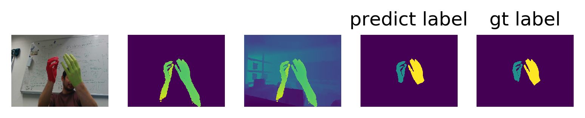

**update:** If you have downloaded the dataset before 3.20, you should go to the link and download
the 'front' part.   
 
Read carefully and edit your own config.py(just a litter difference
 between former version).   
 
When you run the test, I add a parameter  to determine test on which direction('ego' or 'front'). 

## 1. requirements

- numpy
- pytorch >=1.1.0
- tensorboard
- matplotlib
- Pillow  
 
If any other package is missed, just run "pip install xxx" to get it.  
I build the project under ubuntu16.04, cuda 8.0

## 2. Prepare code

clone this repo 

```bash
git clone https://github.com/liwenssss/HandSeg.git
cd HandSeg
```

## 3. Prepare data

download the data from : https://pan.baidu.com/s/1BSQvR_dZpz7-EY_fI-uvvg ,extract code:or0i

If the link is missed, please contact me via email.  

I strongly suggest you open a vip service when you download the data if you find the download speed is slow which will save you time.  

After you finished the download step, modify the config.py:

```python
HAND_SEG_EGO_DATA_PATH = '/path/to/the/dataset/paintedHands/ego'
HAND_SEG_FRONT_DATA_PATH = '/path/to/the/dataset/paintedHands/front'
```

Then, run:

```bash
cd dataset
python generate_data.py --direction "ego"
python generate_data.py --direction "front"
cd ..
```

It will generate 4 npz file under ./dataset:
- ego_train.py
- ego_test.py
- front_train.py
- front_test.py  
  

Modify the config.py again:  

```python
TMP_HAND_SEG_EGO_DATA = '/path/to/the/code/HandsSeg/dataset/ego_train.npz'
TMP_HAND_SEG_EGO_TEST_DATA = '/path/to/the/code/HandsSeg/dataset/ego_test.npz'
TMP_HAND_SEG_FRONT_DATA = '/path/to/the/code/HandsSeg/dataset/front_train.npz'
TMP_HAND_SEG_FRONT_TEST_DATA = '/path/to/the/code/HandsSeg/dataset/front_test.npz'
```

## 4. Test example

You can use the terminal satisfied the requirements to run the following test demo, but I still suggest you using an IDE such as pycharm. All the following test is ok under pycharm.  
The following test include 'ego' view and 'front' view:

#### 4.1 predict the labels of depth images  under example/,  run:

```bash
python test_example.py
```

it will show the input depth image as well as the predict label.

#### 4.2 test on the test dataset:

- if you want to see the visual results , run:
```bash
python test_dataset.py --mode "show" --direction "ego"
```
or
```bash
python test_dataset.py --mode "show" --direction "front"
```

- if you want to save the predicted label, run:
```bash
python test_dataset.py --mode "save" --direction "ego"
```  
or
```bash
python test_dataset.py --mode "save" --direction "front"
```  
it will take about 1 hour, the saved images are like this:  
</br></br>
<p align="center">
    
</p>  
</br>
<p align="center">
    
</p> 
from left to right: rgb image, depth image, my synthesis depth image with environmental information, predict label and ground truth label.   
I use the synthesis depth image as input and output the predict label. 

- if you want to get the mIou score, run:

```bash
python test_dataset.py --mode "miou" --direction "ego"
```  
or
```bash
python test_dataset.py --mode "miou" --direction "front"
```  
it will take about 1 hour. In my experiment, the final mIou score
 of ego view is 0.867  and the final mIou score of front view is 0.846. 


## 5. some results
<p align="center">
    
</p>

<p align="center">
    
</p>
<p align="center">
    
</p>

But we can see that when two hands interact completely, especially when one hand
overlay another hand, the predict result is not good:
<p align="center">
    
</p>
<p align="center">
    
</p>
<p align="center">
    
</p>